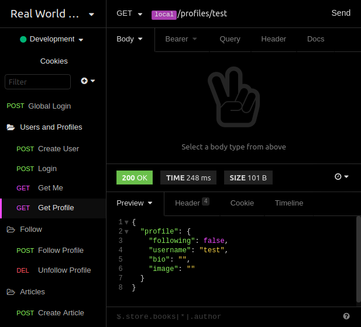

# 

Real World Example using Zeit's Micro and Vincit's Objection

## Introduction

This is a little example of a [Real World App](https://github.com/gothinkster/realworld/tree/master/spec) API specification.

## Project Overview

> "Conduit" is a social blogging site (i.e. a Medium.com clone). It uses a custom API for all requests, including authentication. You can view a live demo over at https://demo.realworld.io

**General functionality:**

- Authenticate users via JWT (login/signup pages + logout button on settings page)
- CRU* users (sign up & settings page - no deleting required)
- CRUD Articles
- CR*D Comments on articles (no updating required)
- GET and display paginated lists of articles
- Favorite articles
- Follow other users

### Getting Started

  1. Clone this [repo](https://github.com/paulogdm/micro-s3-example).
  1. Edit all files at `src/config.js`.
  1. Read [How to use migrations](./db).
  1. Install `micro-dev` globally: "npm i -g micro-dev".
  1. `npm install`.
  1. `npm run start-dev`.

### Rest Client: Insomnia

You can import all requests to use with [Insomnia](https://insomnia.rest/) by clicking [here](.github/Real-World-App_2018-08-14.json).

### Deploying

To deploy this example, you just need to type `now`.
It is advised to take a look at [now secrets](https://zeit.co/docs/getting-started/secrets).

## Disclaimer

This is not a good example of a microsservice application. The API specification is too tightly coupled.
It means that we have too much dependency to justify having more than one service, an example of this would be when accessing `/articles/feed`, where we need to join `users` with `articles` in a very sensitive way.
For now we are not separating this big service into smaller one, but it is possible to add more services like "email", "images", "auth", etc.

Your feedback is appreciated!
