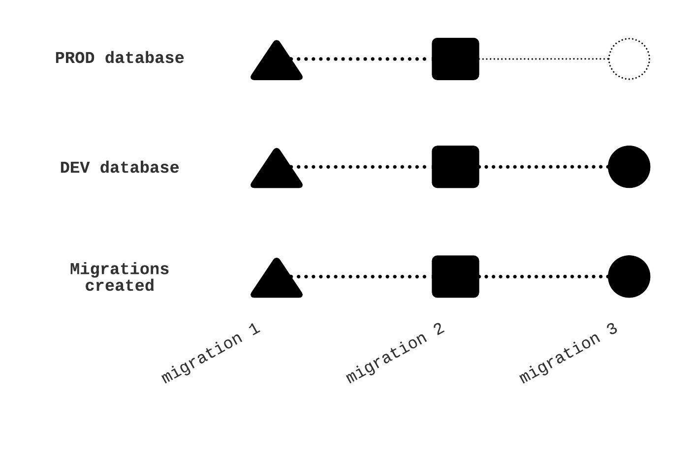

# How to use migrations

You can think migrations like an elevator line:
Each floor is a migration file, the elevator itself is a representation of the current state of you database.
When the elevator goes up, by invoking `knex migrate:latest`, it moves to several floors up, executing the `up` operation of all those floors.
When the elevator goes down, by invoking `knex migrate:rollback`, it moves to exaclty one floor bellow, executing the `down` operation of the above floor.



## Create a new migration

Assuming you are in `/src/db`

```shell
$ knex migrate:make favorite --knexfile ./src/config/knexfile.js --cwd .
```

## Executing a migration

Assuming you are in `/src/db`

```shell
$ knex migrate:latest --knexfile ./src/config/knexfile.js --cwd .
```

Optionally, you can run it with an environment variable:

```shell
$ knex migrate:latest --knexfile ./src/config/knexfile.js --cwd . --env production
```

## Rolling back

Assuming you are in `/src/db`

```shell
$ knex migrate:rollback --knexfile ./src/config/knexfile.js --cwd .
```

Optionally, you can run it with an environment variable:

```shell
$ knex migrate:rollback --knexfile ./src/config/knexfile.js --cwd . --env production
```

## Sources

 * [Knex DOCS](https://knexjs.org/#Migrations)
 * [Objection's ES6 example](https://github.com/Vincit/objection.js/tree/master/examples/express-es6)
